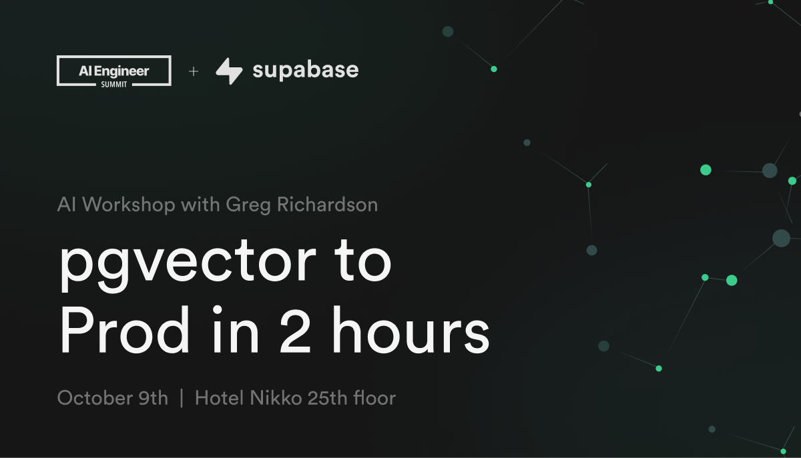

<h1 align="center">Workshop: pgvector to Prod in 2 hours</h1>

Create a production-ready MVP for securely chatting with your documents.

### ☑️ Learning from 👉 [HERE](https://github.com/gregnr/chatgpt-your-files)

### ☑️ I kept my learning 📝notes in different branches, just follow the GR great tutorial and you will learn everything.

### ☑️ From this tutorial you will learn:

- Supabase
- Database migration
- The structure of how to use retrival augmented generation (RAG) to process your files, and query smaller meaningful document sections.
- You will learn pgvector, how to index your text, and create edge functions to process the markdown files into document_sections table.
- You will learn Embedding from GR ❤️, highly recommend his Embedding teaching.
- The interesting step is generating the ueser message embedding in the frontend. Then determine the similarity with markdown files embedding.
